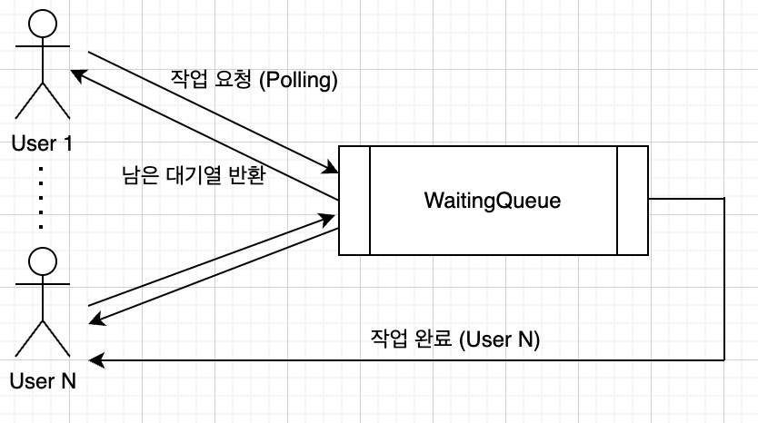

# golang_WaitingQueue
## 개요
- 대기열 시스템

## 특징
- 동일한 작업은 완료되기 전까지 다시 요청 불가
  - 대신 남은 대기열 반환 (ex. 수강신청, 게임 로그인 대기열 등)
- 작업이 완료되면 콜백 실행
- 구현 방법
  - sync.Mutex를 활용한 V1
  - channel을 활용한 V2
## 사용법
```
// 생성 및 시작
waitingQueue := waitingqueue.New()
waitingQueue.Start()

// 커스텀 Config 사용하기
// waitingQueue := waitingqueue.New(waitingqueue.Config{
    IsOldVersion: true, 
    QueueLength: 2000}))

waitGroup := sync.WaitGroup{}
for i := 0; i < 5; i++ {
    waitGroup.Add(1)
    go func(index int) {
        // Task 생성
        task := waitingqueue.NewTask(
            strconv.Itoa(index), // Task 아이디
            pow, // 호출할 함수
            []interface{}{i, 2}) // 호출할 함수 파라미터

        for {
            select {
            case ret := <-task.ReturnChan:
                // 작업 완료, 결과값 처리
                waitGroup.Done()
                return
            default:
                // 작업 요청 및 대기 
                remains := waitingQueue.RequestTask(task)
            }
            time.Sleep(time.Millisecond * 500)
        }

    }(i)
}

waitGroup.Wait()

waitingQueue.Destroy()
```

## 예시
- [example](./example)